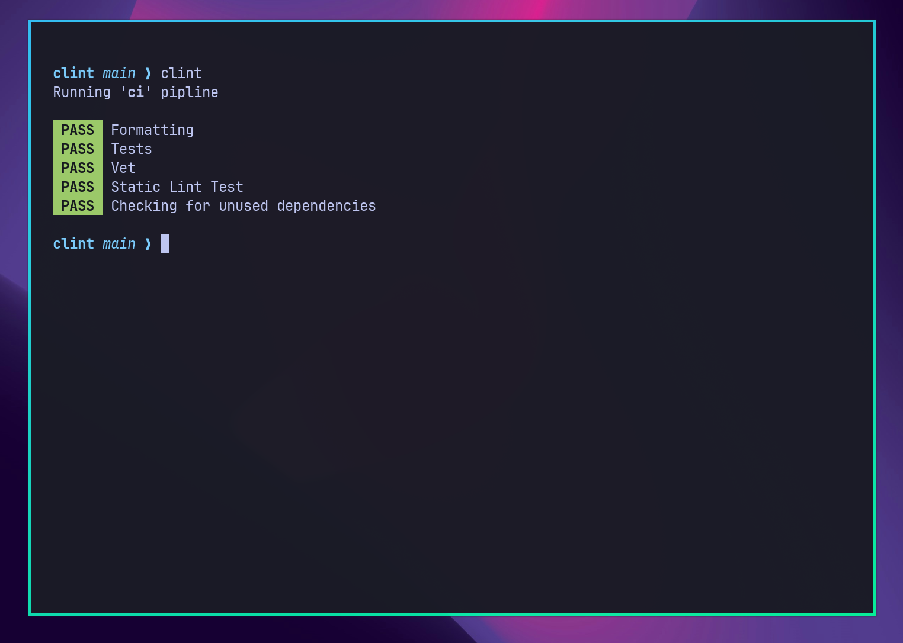

# CLInt

Your friendly **C**ontinuous **L**ocal **I**ntegration assistant.

CLInt allows CI pipelines to be defined and run on local machines, for your developer convenience.



## Installation

Installation requires go to be installed on your machine:

```console
go install github.com/danielronalds/clint@latest
```

### Local Installation

CLInt can also be installed locally to `~/.local/bin/` using mise:

```console
mise build:install
```

## Usage

```
$ clint help
clint v0.1.0

Usage: clint [command | pipeline]

A cli tool for running CI pipelines locally

Running clint with no arguments results in the first declared pipeline being run

Commands
  list      Lists available Pipelines
  help      Show this menu
```
